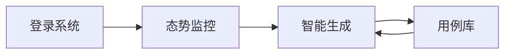

# 飞机调度测试用例生成系统 - 用户使用说明

本文档为系统操作指南，帮助您快速上手并高效使用本系统的全部功能。

---

## 系统概述

本系统是一款基于人工智能的飞机调度测试用例自动生成平台。您可以通过自然语言描述测试需求，系统将自动生成完整的调度仿真方案，并提供评分与资源分析报告。

---

## 使用流程



---

## 1. 登录系统

进入系统后，您将看到登录界面。

| 字段 | 说明 |
|------|------|
| **账号** | 输入您的用户名 |
| **密码** | 输入您的密码 |

---

## 2. 态势监控

登录成功后，默认进入 **态势监控** 页面。此页面展示当前所有飞机的实时状态。

### 飞机状态类型

| 状态 | 含义 | 颜色标识 |
|------|------|----------|
| **就绪 (READY)** | 飞机可用于任务分配 | 绿色 |
| **任务 (ACTIVE)** | 飞机正在执行任务 | 蓝色 |
| **维护 (MAINT)** | 飞机正在维护中 | 黄色 |

### 操作指南

- **筛选飞机**：点击顶部状态按钮（全部/就绪/维护/任务）可快速筛选。
- **查看详情**：点击任意飞机卡片，可查看该飞机的性能参数、燃油储量、润滑油、液压液等详细信息。

---

## 3. 智能用例生成

点击左侧导航栏的 **智能生成**，进入测试用例生成页面。

### 操作步骤

1. **选择测试对象（可选）**  
   在左侧面板顶部，您可以点击飞机卡片来选中参与测试的飞机。选中的飞机会有蓝色高亮边框。

2. **输入测试场景描述**  
   在文本框中用自然语言描述您的测试需求，例如：
   ```
   对 J-20-01 和 J-20-02 进行紧急加油，同时安排机务组进行飞行前检查，要求 30 分钟内完成。
   ```

3. **点击"生成测试用例"**  
   系统将调用 AI 引擎分析您的需求，并生成完整的调度方案。

4. **查看生成结果**  
   生成完成后，右侧面板将显示：
   - **场景名称与评分**
   - **执行序列**：每个任务的详细步骤
   - **资源负载图表**：可视化资源使用情况
   - **系统日志**：模拟执行过程的日志输出

5. **保存用例**  
   点击右上角的 **保存用例** 按钮，将当前方案归档至用例库。

---

## 4. 用例库管理

点击左侧导航栏的 **用例库**，进入已保存用例的管理页面。

### 功能说明

| 功能 | 操作方式 |
|------|----------|
| **搜索用例** | 在搜索框输入关键词，可按场景名称或标签筛选 |
| **新建需求** | 点击"新建需求"按钮，填写场景名称、标签和详细描述后，跳转至生成页面 |
| **编辑用例** | 点击用例卡片，可修改场景名称和标签 |
| **加载场景** | 点击"加载场景"按钮，将该用例加载至智能生成页面进行复用 |
| **删除用例** | 点击垃圾桶图标删除用例 |

### 新建需求弹窗

| 字段 | 说明 |
|------|------|
| **场景名称** | 为用例指定一个易于识别的名称 |
| **标签** | 用逗号分隔，例如：`J-20, 紧急, 加油` |
| **详细需求描述** | 描述调度逻辑或故障场景 |
| **AI 润色** | 点击此按钮，系统将用专业术语优化您的描述 |

---
